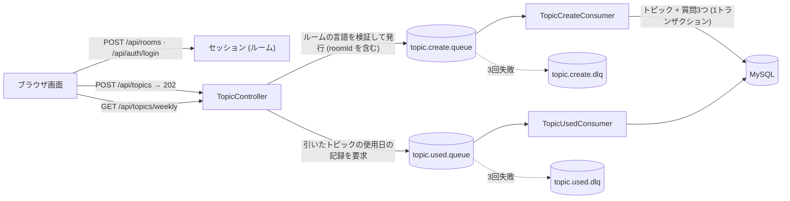

# 🗣️ language-exchange

[한국어](README.md) | **日本語**

**2人で1つのルームを共有して使う、言語交換のトピック＆質問ガイドサービス**

お互いの言語を学ぶ2人が**ルーム（共有アカウント）** を1つ作り、毎週話す**トピックを引き**、トピックごとに用意された**質問3つ**で会話を続けるWebサービスです。

- **ルーム＝共有アカウント**：個人アカウントはありません。ルームIDとパスワードを2人で共有し、それぞれの端末から同じルームに入ります。
- **10言語**：韓国語、日本語、英語、中国語（簡体字）、スペイン語、フランス語、アラビア語、ベトナム語、タイ語、イタリア語。ルーム作成時にそれぞれが**学びたい言語**を選ぶと、その2言語がルームの言語になります。
- **トピックと質問はルームの2言語**をペアにして保存し、画面では2言語を並べて表示するか、トグルで切り替えて見ます。
- トピックは1週間（月〜日）に**1回だけ**引けます。今週すでに引いていれば同じトピックが表示され続け、まだ使っていないトピックの中からだけランダムに選ばれます。
- これまで話したトピックは**回ごとの学習記録**として見返せます。
- トピック・質問・記録・今週のトピックは**ルームごとに完全に分離**されています。

---

## 🏛️ System Architecture Overview

- **単一アプリケーション構成**：Spring Boot 1つがREST APIと画面（HTML/CSS/JS）を一緒に提供します。別のフロントサーバーやビルド工程はありません。
- **ルーム単位の認証**：ルームID/パスワードでログインすると、サーバーセッションにルームが記録されます。すべてのAPIはセッションのルームを基準に動作し、URIにルーム番号は含まれません。
- **非同期書き込み構成**：トピック登録と「今週のトピックの使用済み処理」はRabbitMQを経由して処理します。APIは検証だけ行って`202 Accepted`で即座に応答し、実際の保存はConsumerが担当します。
- **障害対策**：Consumerが失敗した場合は最大3回まで試行し、すべて失敗したらDLQ（Dead Letter Queue）に送ってメッセージが失われないようにします。
- **単一RDB**：MySQLにルーム（`rooms`）、トピック（`topics`）、質問（`questions`）を保存します。複数の言語を一緒に保存するため`utf8mb4`を使います。



---

## 🛠️ Tech Stack

### Backend
- **Java 25 / Spring Boot 4.1** (Spring Framework 7, Hibernate 7, Jackson 3)
- **Spring Security**：サーバーセッション方式。パスワードはBCryptハッシュのみ保存します。
- **Spring Data JPA & QueryDSL 5.1**：「まだ使っていないトピックを優先 → 名前順」のソートを`CASE`式で記述しました。一覧は`Slice`で取得し、`count`クエリなしで`hasNext`だけを判定します。
- **Spring Validation**：リクエストDTOで必須値と形式を検証します。
- **Spring AMQP (RabbitMQ)**：登録/使用処理を非同期化し、JSONメッセージコンバーターとリトライ・DLQ構成を適用しました。
- **SpringDoc OpenAPI**：Swagger UIでAPIドキュメントを自動化しました。
- **MySQL 8**

### Frontend
- **Vanilla HTML / CSS / JavaScript**：フレームワークやビルドツールなしで`static/`フォルダから配信します。
- **画面文言10言語**：独自エンジン（`i18n.js`）と言語別の辞書ファイル。日付と国名はブラウザの`Intl` APIが画面言語に合わせて生成します。
- **Google Fonts**：韓国語`Gowun Dodum`、日本語`Zen Maru Gothic`、中国語`Noto Sans SC`。それ以外の言語は端末の標準フォントを使います。
- 文字色は言語ではなく**位置（スロット）** に紐づきます：ルームの1番目の言語(A)は**青**、2番目の言語(B)は**赤**。
- **言語別モチーフ**：10言語それぞれに、その文化の花・文様を手描きしたSVGを用意し、2つの言語が出会う意味として**重なる2輪の花**をシンボルにしました。

### Infra
- **Docker Compose**：MySQLとRabbitMQ（管理コンソール付き）を一度に起動します。
- **環境変数**：`.env`ファイルを`spring.config.import`で読み込み、DBの認証情報をコードの外で管理します。

---

## 🔐 認証

| 項目 | 内容 |
|---|---|
| ログインの主体 | 人ではなく**ルーム**。同じルームアカウントで複数の端末が同時にログインできます。 |
| 方式 | サーバーセッション。Cookieは`HttpOnly`、`SameSite=Lax`、30日間保持 |
| パスワード | BCryptハッシュのみ保存。**復旧手段はありません**（メールアドレスなどを受け取らないため）。 |
| 公開されているパス | 画面ファイル（`/`, `*.html`, `favicon.svg`, `css/**`, `js/**`, `img/**`）、`POST /api/rooms`、`POST /api/auth/login`、Swagger |
| それ以外のリクエスト | ログインしていなければ`401`（`errorCode: UNAUTHORIZED`）。画面は`401`を受け取ると`enter.html`へ移動します。 |
| CSRF | 無効 + `SameSite=Lax`（外部公開の前に再検討） |

セッションはサーバーのメモリ上にあるため、**サーバーを再起動すると再ログイン**が必要です。

---

## 📡 API

### 一覧（全11個）

| # | Method | URI | 説明 | ログイン | レスポンス |
|---|---|---|---|:---:|---|
| 1 | `POST` | `/api/rooms` | ルーム作成（作成後そのままログイン） | 不要 | `201` / `400` / `409` |
| 2 | `GET` | `/api/rooms` | 現在のルーム情報の取得 | 必要 | `200` / `401` |
| 3 | `POST` | `/api/auth/login` | ルームID/パスワードでログイン | 不要 | `200` / `400` / `401` |
| 4 | `POST` | `/api/auth/logout` | ログアウト | 必要 | `200` / `401` |
| 5 | `POST` | `/api/topics` | トピック1つ + 質問3つの登録リクエスト（非同期） | 必要 | `202` / `400` / `401` |
| 6 | `POST` | `/api/topics/bulk-create` | トピック複数の一括登録リクエスト（非同期） | 必要 | `202` / `400` / `401` |
| 7 | `GET` | `/api/topics/weekly` | **今週のトピックを引く**（すでに引いていればそのトピック） | 必要 | `200` / `401` / `404` |
| 8 | `GET` | `/api/topics/this-week` | 今週**すでに引いた**トピックの取得（引かない） | 必要 | `200` / `401` |
| 9 | `GET` | `/api/topics` | 全トピック一覧（`Slice`） | 必要 | `200` / `401` |
| 10 | `GET` | `/api/topics/history` | 回ごとの学習記録（`Slice`） | 必要 | `200` / `401` |
| 11 | `GET` | `/api/topics/{topicId}/questions?lang=` | トピックの質問3つ（言語指定） | 必要 | `200` / `400` / `401` / `404` |

- Swagger UI：`http://localhost:8080/swagger-ui.html`
- すべてのAPIは`Content-Type: application/json`を使い、ログイン後はセッションCookie（`JSESSIONID`）が自動的に一緒に送信されます。
- ログインが必要なAPIをログインなしで呼ぶと、すべて`401 UNAUTHORIZED`になります。重複を避けるため、以下の詳細では省略しています。
- `roomId`はセッションからのみ取り出します。クライアントが送った値は受け取らず、URIにもルーム番号はありません。
- 他のルームの`topicId`は、存在の有無を隠すために`404`で応答します。

### 共通ルール

**レスポンス形式** — 成功も失敗も同じ枠組みを使います。失敗レスポンスには`errorCode`が入り、画面はこの値で画面言語に合った文言を選んで表示します。

```json
{ "success": true, "code": 200, "message": "주제 목록 조회 성공", "data": { } }
```
```json
{ "success": false, "code": 409, "errorCode": "DUPLICATE_ROOM_ID", "message": "이미 사용 중인 방 아이디입니다.", "data": null }
```

| フィールド | 型 | 説明 |
|---|---|---|
| `success` | boolean | 成功したかどうか |
| `code` | number | HTTPステータスコードと同じ値 |
| `errorCode` | string | 失敗レスポンスにのみ存在（成功時はフィールド自体がありません） |
| `message` | string | 韓国語の説明文（画面は`errorCode`を使って、画面言語の文言を別に選びます） |
| `data` | object / array / null | レスポンス本体。入力検証の失敗（`INVALID_INPUT`）のときは、問題のあるフィールドの一覧（`["loginId: 방 아이디는 영문 소문자·숫자·-·_ 4~20자여야 합니다."]`）が入ります。 |

**言語が入る値** — 常に`{ "lang": "KO", "text": "공원" }`の形です。`lang`は`KO, JA, EN, ZH, ES, FR, AR, VI, TH, IT`のいずれかで、レスポンスの`names`はルームの1番目の言語(A)、2番目の言語(B)の順です。

**一覧（`Slice`）レスポンス** — `count`クエリなしで、次のページがあるかどうかだけを返します。

| フィールド | 型 | 説明 |
|---|---|---|
| `content` | array | 現在のページの項目 |
| `page` | number | 現在のページ（0始まり） |
| `size` | number | ページサイズ |
| `hasNext` | boolean | 次のページがあるかどうか |

クエリパラメータ：`page`（デフォルト0）、`size`（デフォルト20）。`sort`は並び順が固定のため無視されます。

---

### 1. ルーム作成 `POST /api/rooms`

ルームIDとパスワード、2人の情報でルームを作り、**そのままログイン**します。（レスポンスにセッションCookieが一緒に返されます。）
お互いの言語を学ぶ交換なので、一方の**使う言語**は、相手の**学びたい言語**で決まります。2つの言語は互いに異なる必要があります。

**Request Body**

| フィールド | 型 | 必須 | 制約 |
|---|---|:---:|---|
| `loginId` | string | O | 英小文字・数字・`-`・`_` の4〜20文字。重複不可 |
| `password` | string | O | 英数字・記号（ASCII）の8〜64文字（BCryptの72バイト制限のためASCIIのみ許可） |
| `members` | array | O | ちょうど2つ：**[1人目(A), 2人目(B)]** の順 |
| `members[].name` | string | O | 50文字以下、空白のみは不可 |
| `members[].nationality` | string | O | ISO 3166-1 alpha-2 国コード（`KR`, `JP` …）。実在するコードかどうかはサービス側でもう一度確認 |
| `members[].learningLanguage` | string | O | その人が学びたい言語（`Language`の値） |
| `goal` | number | O | 目標学習回数。`25`、`50`、`75`、`100` のいずれか |

```json
{
  "loginId": "our-room",
  "password": "password123",
  "members": [
    { "name": "민수", "nationality": "KR", "learningLanguage": "JA" },
    { "name": "ゆい", "nationality": "JP", "learningLanguage": "KO" }
  ],
  "goal": 50
}
```

上のリクエストなら、1人目(A)は韓国語(KO)、2人目(B)は日本語(JA)を使います。

**Response `201 Created`**

```json
{ "success": true, "code": 201, "message": "방이 만들어졌습니다.", "data": null }
```

**失敗**

| errorCode | HTTP | 状況 |
|---|---|---|
| `INVALID_INPUT` | 400 | 必須値の欠落、形式エラー（ID・パスワードの規則、`members`が2つではない）、存在しない言語コード、`goal`が25/50/75/100以外 |
| `SAME_LANGUAGE` | 400 | 2人が同じ言語を学ぶと選択した |
| `INVALID_NATIONALITY` | 400 | 国籍が実在するISO国コードではない |
| `DUPLICATE_ROOM_ID` | 409 | すでに存在するルームID |

---

### 2. 現在のルーム情報 `GET /api/rooms`

ログイン中のルームのIDと、2人の名前・国籍・使う言語（`language`）・学びたい言語（`learningLanguage`）を返します。`members`は常に[A, B]の順です。`goal`は目標学習回数、`studiedCount`はこれまでに引いて使ったテーマの数です。画面はこのレスポンスでルームの2言語とモチーフを決めます。

**Response `200 OK`**

```json
{
  "success": true,
  "code": 200,
  "message": "방 정보 조회 성공",
  "data": {
    "loginId": "our-room",
    "members": [
      { "name": "민수", "nationality": "KR", "language": "KO", "learningLanguage": "JA" },
      { "name": "ゆい", "nationality": "JP", "language": "JA", "learningLanguage": "KO" }
    ],
    "goal": 50,
    "studiedCount": 3
  }
}
```

**失敗**

| errorCode | HTTP | 状況 |
|---|---|---|
| `UNAUTHORIZED` | 401 | ログインしていない |
| `ROOM_NOT_FOUND` | 401 | セッションはあるのにルームが存在しない（再ログインが必要） |

---

### 3. ログイン `POST /api/auth/login`

ルームIDとパスワードでログインします。成功するとセッションCookie（`HttpOnly`、`SameSite=Lax`、30日間）が発行されます。同じルームアカウントで複数の端末が同時にログインできます。

**Request Body**

| フィールド | 型 | 必須 | 制約 |
|---|---|:---:|---|
| `loginId` | string | O | 空白不可 |
| `password` | string | O | 空白不可 |

```json
{ "loginId": "our-room", "password": "password123" }
```

**Response `200 OK`**

```json
{ "success": true, "code": 200, "message": "로그인 성공", "data": null }
```

**失敗**

| errorCode | HTTP | 状況 |
|---|---|---|
| `INVALID_INPUT` | 400 | IDまたはパスワードが空 |
| `INVALID_CREDENTIALS` | 401 | IDまたはパスワードが違う（**どちらが違うかは区別しません**） |

---

### 4. ログアウト `POST /api/auth/logout`

現在のセッションを終了します。リクエストボディはありません。他の端末で同じルームにログインしているセッションには影響しません。

**Response `200 OK`**

```json
{ "success": true, "code": 200, "message": "로그아웃 성공", "data": null }
```

**失敗**：ログインしていなければ`401 UNAUTHORIZED`。

---

### 5. トピック1つ + 質問3つの登録 `POST /api/topics`

ログイン中のルームにトピック1つと質問3つを登録します。検証だけ行ってキュー（`topic.create.queue`）に入れ、**即座に`202`** で応答し、実際の保存はConsumerが非同期で処理します。トピック1つと質問3つは**1メッセージ・1トランザクション**なので、1つでも保存に失敗すればすべて取り消されます。

**Request Body**

| フィールド | 型 | 必須 | 制約 |
|---|---|:---:|---|
| `names` | array | O | ちょうど2つ。**ルームの2言語が1つずつ**（順序は問いません） |
| `names[].lang` | string | O | `Language`の値 |
| `names[].text` | string | O | 空白不可、255文字以下 |
| `questions` | array | O | **ちょうど3つ**（並び順が`sequence` 1〜3になります） |
| `questions[].contents` | array | O | ちょうど2つ。質問1つを**ルームの2言語で1つずつ** |
| `questions[].contents[].lang` | string | O | `Language`の値 |
| `questions[].contents[].text` | string | O | 空白不可、255文字以下 |

```json
{
  "names": [
    { "lang": "KO", "text": "공원" },
    { "lang": "JA", "text": "公園" }
  ],
  "questions": [
    { "contents": [ { "lang": "KO", "text": "좋아하는 공원에 대해 설명해주세요." }, { "lang": "JA", "text": "好きな公園について説明してください。" } ] },
    { "contents": [ { "lang": "KO", "text": "공원에 가면 주로 무엇을 하나요?" }, { "lang": "JA", "text": "公園に行ったら、主に何をしますか？" } ] },
    { "contents": [ { "lang": "KO", "text": "최근에 공원에 간 경험을 말해주세요." }, { "lang": "JA", "text": "最近公園に行った経験を話してください。" } ] }
  ]
}
```

**Response `202 Accepted`**

```json
{ "success": true, "code": 202, "message": "주제 등록 요청이 접수되었습니다.", "data": null }
```

> `202`は「受付完了」であり「保存完了」ではありません。保存が終わったトピックは`GET /api/topics`に表示されます。

**失敗**

| errorCode | HTTP | 状況 |
|---|---|---|
| `INVALID_INPUT` | 400 | 必須値の欠落、255文字超過、`names`/`contents`が2つではない、`questions`が3つではない（DTO検証）、存在しない言語コード |
| `INVALID_QUESTION_COUNT` | 400 | 質問が3つではない（サービス段階の防御チェック） |
| `LANGUAGE_NOT_IN_ROOM` | 400 | ルームの2言語ではない言語を使った、または同じ言語を2回使った |

---

### 6. トピック複数の一括登録 `POST /api/topics/bulk-create`

トピックを複数まとめて登録リクエストします。各トピックの形式は5番と同じで、**トピック1つにつきメッセージ1つ**に分けて処理されます。1つのトピックが保存に失敗しても残りは保存され、**キューに入れる前に全体の入力を先に検証**するため、形式が間違っているトピックが1つでもあれば全体を拒否します。

**Request Body**

| フィールド | 型 | 必須 | 制約 |
|---|---|:---:|---|
| `topics` | array | O | 1つ以上。各項目は5番のRequest Bodyと同じ |

```json
{
  "topics": [
    {
      "names": [ { "lang": "KO", "text": "공원" }, { "lang": "JA", "text": "公園" } ],
      "questions": [
        { "contents": [ { "lang": "KO", "text": "질문 1" }, { "lang": "JA", "text": "質問1" } ] },
        { "contents": [ { "lang": "KO", "text": "질문 2" }, { "lang": "JA", "text": "質問2" } ] },
        { "contents": [ { "lang": "KO", "text": "질문 3" }, { "lang": "JA", "text": "質問3" } ] }
      ]
    },
    {
      "names": [ { "lang": "KO", "text": "여행" }, { "lang": "JA", "text": "旅行" } ],
      "questions": [ "… 同じ形式で3つ …" ]
    }
  ]
}
```

**Response `202 Accepted`**

```json
{ "success": true, "code": 202, "message": "주제 일괄 등록 요청이 접수되었습니다.", "data": null }
```

**失敗**：5番と同じです。`topics`が空なら`INVALID_INPUT`。

---

### 7. 今週のトピックを引く `GET /api/topics/weekly`

今週（月〜日）にすでに引いたトピックがあれば、**そのトピックをそのまま**返します。なければ、ログイン中のルームの**まだ使っていないトピックの中からランダムに1つ**を引いて返し、そのトピックの使用日を記録するリクエストを`topic.used.queue`に非同期で送ります。

- 翌週になると、また新しいトピックを引けます。
- 引かずに、すでに引いたかどうかだけを確認するには8番（`this-week`）を使ってください。

**Response `200 OK`**

```json
{
  "success": true,
  "code": 200,
  "message": "주제 조회 성공",
  "data": {
    "id": 5,
    "names": [ { "lang": "KO", "text": "공원" }, { "lang": "JA", "text": "公園" } ]
  }
}
```

**失敗**

| errorCode | HTTP | 状況 |
|---|---|---|
| `NO_AVAILABLE_TOPIC` | 404 | 引ける未使用のトピックがない（トピックを追加登録する必要があります） |

---

### 8. 今週すでに引いたトピック `GET /api/topics/this-week`

今週引いたトピックがあれば返し、**なければ`data`が`null`** です。トピックを引くことも、使用済みにすることもしません。画面はこのAPIを使って、ホームを開いたときに不要な「引く」ボタンを隠します。

**Response `200 OK` — 引いたトピックがあるとき**

```json
{
  "success": true,
  "code": 200,
  "message": "이번 주 주제 조회 성공",
  "data": {
    "id": 5,
    "names": [ { "lang": "KO", "text": "공원" }, { "lang": "JA", "text": "公園" } ]
  }
}
```

**Response `200 OK` — まだ引いていないとき**

```json
{ "success": true, "code": 200, "message": "이번 주 주제 조회 성공", "data": null }
```

---

### 9. 全トピック一覧 `GET /api/topics`

使用の有無に関係なく、ルームの全トピックを`Slice`で返します。**並び順は固定**です：まだ使っていないトピックが先、同じグループの中ではルームの1番目の言語(A)の名前順。`usedDate`が`null`ならまだ使っていないトピックです。

**Query Parameters**：`page`（デフォルト0）、`size`（デフォルト20）

**Response `200 OK`**

```json
{
  "success": true,
  "code": 200,
  "message": "주제 목록 조회 성공",
  "data": {
    "content": [
      { "id": 7, "names": [ { "lang": "KO", "text": "여행" }, { "lang": "JA", "text": "旅行" } ], "usedDate": null },
      { "id": 5, "names": [ { "lang": "KO", "text": "공원" }, { "lang": "JA", "text": "公園" } ], "usedDate": "2026-10-08" }
    ],
    "page": 0,
    "size": 20,
    "hasNext": false
  }
}
```

---

### 10. 回ごとの学習記録 `GET /api/topics/history`

言語交換で使ったトピックを**第1回から**順に返します。回はカレンダー上の第何週かではなく、**引いた順序**です。最初に引いたトピックが第1回で、1週間飛ばしても回は欠番なしで続きます。回はDBに保存せず、使用日の昇順の結果の順序から、取得時に計算します。各項目の`id`で11番を呼ぶと、そのトピックの質問を見返せます。

**Query Parameters**：`page`（デフォルト0）、`size`（デフォルト20）

**Response `200 OK`**

```json
{
  "success": true,
  "code": 200,
  "message": "주차별 학습 기록 조회 성공",
  "data": {
    "content": [
      {
        "id": 5,
        "round": 1,
        "names": [ { "lang": "KO", "text": "공원" }, { "lang": "JA", "text": "公園" } ],
        "usedDate": "2026-10-08"
      }
    ],
    "page": 0,
    "size": 20,
    "hasNext": false
  }
}
```

---

### 11. トピックの質問3つ `GET /api/topics/{topicId}/questions?lang=`

指定したトピックの質問3つを**1つの言語で**返します。画面の言語トグルは、このAPIを`lang`だけ変えて呼び直す方式です。

**Path / Query Parameters**

| 名前 | 位置 | 必須 | 説明 |
|---|---|:---:|---|
| `topicId` | path | O | トピック番号 |
| `lang` | query | O | **ルームの2言語のうちの1つ**（例：`KO`、`JA`） |

**Response `200 OK`** — `GET /api/topics/5/questions?lang=JA`

```json
{
  "success": true,
  "code": 200,
  "message": "질문 조회 성공",
  "data": {
    "topicId": 5,
    "language": "JA",
    "questions": [
      { "sequence": 1, "content": "好きな公園について説明してください。" },
      { "sequence": 2, "content": "公園に行ったら、主に何をしますか？" },
      { "sequence": 3, "content": "最近公園に行った経験を話してください。" }
    ]
  }
}
```

**失敗**

| errorCode | HTTP | 状況 |
|---|---|---|
| `INVALID_INPUT` | 400 | `lang`がない、存在しない言語コード（`lang=XX`）、`topicId`が数字ではない |
| `LANGUAGE_NOT_IN_ROOM` | 400 | 存在する言語だが、このルームの2言語ではない |
| `TOPIC_NOT_FOUND` | 404 | トピックがない、または**他のルームのトピック**（存在を隠すため同じレスポンス） |

---

### 全errorCode

| errorCode | HTTP | 状況 |
|---|---|---|
| `INVALID_INPUT` | 400 | 必須値の欠落、形式エラー、不正なJSON・言語コード、`lang`の欠落 |
| `SAME_LANGUAGE` | 400 | 2人が同じ言語を学ぶと選択した |
| `INVALID_NATIONALITY` | 400 | 国籍がISO 3166-1 alpha-2の国コードではない |
| `LANGUAGE_NOT_IN_ROOM` | 400 | ルームの2言語ではない言語で登録・取得した |
| `INVALID_QUESTION_COUNT` | 400 | 質問が3つではない |
| `UNAUTHORIZED` | 401 | ログインしていない |
| `INVALID_CREDENTIALS` | 401 | ルームIDまたはパスワードが違う（両者を区別しない） |
| `ROOM_NOT_FOUND` | 401 | セッションはあるのにルームがない（再ログインが必要） |
| `ACCESS_DENIED` | 403 | 権限がない |
| `TOPIC_NOT_FOUND` | 404 | トピックがない、または他のルームのトピック |
| `NO_AVAILABLE_TOPIC` | 404 | 引ける未使用のトピックがない |
| `NOT_FOUND` | 404 | 存在しないパス |
| `DUPLICATE_ROOM_ID` | 409 | すでに存在するルームID |
| `INTERNAL_SERVER_ERROR` | 500 | 予期しないエラー |

### 非同期メッセージ（RabbitMQ）

APIのレスポンスとは別に、サーバー内部でやり取りされるメッセージです。

| Exchange | Queue | Routing Key | DLQ | 発行するAPI | 処理内容 |
|---|---|---|---|---|---|
| `topic.exchange` | `topic.create.queue` | `topic.create` | `topic.create.dlq` | `POST /api/topics`, `POST /api/topics/bulk-create` | トピック1つ + 質問3つを1トランザクションで保存（メッセージに`roomId`を含む） |
| `topic.exchange` | `topic.used.queue` | `topic.used` | `topic.used.dlq` | `GET /api/topics/weekly` | 引いたトピックの使用日（`used_date`）を記録 |

- Consumerは2秒 → 4秒の間隔で**最大3回**試行し、すべて失敗したらDLQ（`topic.dlx`）へ移動します。
- Consumerは、同じメッセージが2回届いても結果が同じになるように作ってあります（冪等）。

---

## 🖥️ Frontend 画面

サーバーを起動したら、`http://localhost:8080`ですぐに使えます。スマートフォン・PCの両方の画面に対応しています。

| ページ | ファイル | 説明 |
|---|---|---|
| 入口 | `enter.html` | **ログイン / ルーム作成**タブ。ルーム作成では、ルームID・パスワードと2人の名前・国籍・学びたい言語を1画面で入力します。 |
| ホーム | `index.html` | 今週のトピックを引きます。すでに引いていればボタンなしでそのままトピックを表示し、次に引ける日付を案内します。カードを押すと質問が開きます。 |
| 全トピック | `topics.html` | 登録されたすべてのトピック。「まだ使っていないトピック / 使ったトピック」のグループに分かれ、`もっと見る`で続きを読み込みます。 |
| 学習記録 | `history.html` | 第1回からこれまでに話したトピックの一覧。今週の記録は強調されます。 |
| トピック登録 | `register.html` | トピックと質問3つを、ルームの2言語をペアにして入力します。**1つずつ / 複数まとめて**の方式を選べます。 |

- **共通ヘッダー**：ロゴ、メニュー、画面言語の選択、ログアウトは`common.js`がすべてのページに描画します。HTMLには空の`<header>`だけがあります。
- **質問シート**：トピックを押すと質問3つが開き、ルームの2言語のトグルで言語を切り替えます。最後に選んだ言語はルームごとにブラウザに記憶されます。
- **入力検証**：空欄があれば送信せず、該当の欄を表示します。文字数はDBカラムの長さ（255文字）に合わせて制限しました。

### 多言語対応

2種類の言語を区別します。

| | 何か | どう決まるか |
|---|---|---|
| **ルームの言語** | トピック・質問の内容に使う2言語 | ルーム作成時にそれぞれが選んだ「学びたい言語」 |
| **画面言語** | メニュー・ボタン・案内文言 | ① ヘッダーで直接選んだ値（ブラウザに保存） → ② ブラウザの言語 → ③ 英語。ルームの言語とは無関係で、1つの端末では1つの言語だけを表示します。 |

- `js/languages.js`：10言語のメタデータ（その言語で書いた名前、HTMLの`lang`値、文字の方向、画面言語として使えるか、モチーフ画像と補助色）。言語情報はここ1か所だけで管理し、他のコードでは言語コードで分岐しません。
- `js/i18n.js`：画面文言エンジン。HTMLには`data-i18n="home.hero.title"`のようにキーだけを書き、`t('register.topicNo', { no: 1 })`のように値を入れられます。画面言語を変えると、リロードなしで切り替わります。
- `js/i18n/*.js`：言語別の辞書10個（`ko`, `ja`, `en`, `zh`, `es`, `fr`, `ar`, `vi`, `th`, `it`）。キー構成はすべて同じで、欠けているキーは英語で表示します。
  韓国語・日本語・英語以外の辞書は**AI翻訳の下書き**であり、ネイティブによるチェックが必要です。
- **サーバーエラー**は、レスポンスの`errorCode`で辞書の`error.<errorCode>`の文言を探し、画面言語で表示します。
- **アラビア語（RTL）**：画面言語がアラビア語なら`<html dir="rtl">`に切り替わり、余白や位置はCSSの論理プロパティ（`margin-inline-*`, `inset-inline-*`）で書いてあるので、左右が反転します。
- ユーザーが入力したトピック・質問は翻訳せず、内容の実際の言語で`lang`/`dir`属性を付けます。

### 言語別モチーフ

言語ごとに、その文化を込めた装飾画像（モチーフ）が1つずつあります。

| 言語 | モチーフ | 言語 | モチーフ |
|---|---|---|---|
| 韓国語 | ムクゲ | フランス語 | アイリス |
| 日本語 | 桜 | アラビア語 | ジャスミンと八角星の文様 |
| 英語 | チューダー・ローズ | ベトナム語 | ハス |
| 中国語 | ボタン | タイ語 | ラーチャプルック（ゴールデンシャワーの花） |
| スペイン語 | 赤いカーネーション | イタリア語 | 白いユリ |

- **データ**：`languages.js`の`motif`（SVGのパス）と`accent`（その絵に合う補助色）。絵は`static/img/motif/<言語>.svg`に、手描きのシンプルなベクターとして1つずつあります。
- **適用**：`common.js`の`applyMotifs()`が、CSS変数`--motif-a/b`（絵）、`--accent-a/b`（補助色）と`<html data-motifs="pair|single">`を設定します。CSSはこの変数だけを使い、どの言語かは知りません。
- **どこに何が出るか**
    - ルームに入る前（`enter.html`）：**画面言語**のモチーフ1つ — ヘッダーのマーク、タイトルの横、背景の円の色。画面言語を変えると一緒に変わります。
    - ルームの中：**ルームの2言語(A, B)** のモチーフを並べて — ヘッダーのマーク、トピックカードの2輪の花、背景の円の色、空の一覧画面（`createMotifPair()`が作る1組）。画面言語を変えても変わりません。
- **色**：モチーフは自分の色を持つ装飾で、位置（A 青 / B 赤）の文字色とは独立しています。たとえば日本語がAの位置にあるルームでは、桜はピンク、文字は青になります。
- 装飾には`aria-hidden="true"`を付けて、スクリーンリーダーが読み上げないようにしています。

### 言語を追加するには

3つ追加すれば完了です。① `js/languages.js`にメタデータを1行（名前、`tag`、`dir`、`ui`、`motif`、`accent`） ② `static/img/motif/<言語>.svg`のモチーフ画像を1つ ③ 画面言語としても使うなら`js/i18n/<言語>.js`の辞書を1つ（キーは他の辞書と同じにします。なければ`ui: false`にして英語の画面を使います）。トピック・質問の内容の言語として使うには、サーバーの`Language` enumにも同じ名前の値を追加します。それ以外のJS・CSSは変更しません。

---

## 🚀 Key Design Points

1. **ルームごとに言語2枠（A/Bスロット）**
    - 言語が10個あっても、ルームは常に2言語だけを使うので、翻訳テーブルなしで`name_a`/`name_b`、`content_a`/`content_b`の2つのカラムに保存します。
    - A/BはDBの中だけで使う表現です。APIは`{lang, text}`に展開してやり取りし、サービスがルームの言語と合っているかを検証します。
    - A = 1人目が使う言語（= 2人目が学びたい言語）、B = 2人目が使う言語。
2. **ルームの分離**
    - ルームが所有するデータを読むすべてのクエリに`roomId`の条件が入ります。`roomId`はセッションからのみ取り出し、クライアントが送った値は受け取りません。
3. **回（Round）の計算**
    - カレンダー上の第何週ではなく、**引いた順序**で数えます。最初に引いたトピックが第1回で、1週間飛ばしても回は欠番なしで続きます。
    - 回はDBに保存せず、使用日の昇順で取得した結果の順序から、取得時に計算します。
4. **1週間に1回だけ引くルール**
    - 週（月〜日）を基準に、今週に使用済みとなったトピックがあればそのまま返します。すでに引いたかどうかは`GET /api/topics/this-week`で**引かずに**確認できるので、画面を開いたときに不要な「引く」ボタンを隠せます。
5. **非同期登録と原子性**
    - トピック1つと質問3つは、1メッセージ・1トランザクションで保存します。質問が1つでも保存に失敗すれば、トピックまでロールバックされます。
    - 複数登録は、トピック1つにつきメッセージ1つに分けるので、1つのトピックが失敗しても残りは保存されます。キューに入れる前に、全体の入力を先に検証します。
6. **リトライとDLQ**
    - Consumerは2秒 → 4秒の間隔で最大3回試行し、すべて失敗したらDLQ（`topic.create.dlq`, `topic.used.dlq`）へ移動します。
7. **一貫したコードコンベンション**
    - `Request → Command → Result → Response`のDTO階層分離、`Service`（書き込み）/ `QueryService`（取得、`readOnly`）の分離、エンティティは`create()`静的ファクトリで生成、共通レスポンス`ApiResponse` / `SliceResponse`を使います。

---

## 📁 Project Structure

```
exchange
├── docker-compose.yml           # MySQL, RabbitMQ
├── .env.example                 # 環境変数の例 (実際の .env はコミットしない)
├── build.gradle
└── src
    ├── main
    │   ├── java/language/exchange
    │   │   ├── ExchangeApplication.java
    │   │   ├── global
    │   │   │   ├── config           # documentation, querydsl, rabbitmq, security
    │   │   │   ├── constants        # StudyConstants, RabbitMQConstants
    │   │   │   ├── domain           # BaseTimeEntity
    │   │   │   ├── dto/response     # ApiResponse, SliceResponse
    │   │   │   ├── exception        # ErrorCode, BusinessException, GlobalExceptionHandler
    │   │   │   └── util             # SliceUtil, WeekUtils
    │   │   ├── auth                 # ログイン・ログアウト (AuthController, AuthService)
    │   │   ├── room                 # ルーム作成・ルーム情報 (Room, Language, RoomService, RoomQueryService)
    │   │   └── study                # トピック・質問
    │   │       ├── controller       # TopicController
    │   │       ├── domain           # Topic, Question
    │   │       ├── dto              # request / command / result / response
    │   │       ├── repository       # TopicRepository (+ QueryDSL custom/impl), QuestionRepository
    │   │       ├── service          # TopicService(書き込み), TopicQueryService(取得)
    │   │       ├── event            # キューに送るメッセージオブジェクト
    │   │       ├── publisher        # メッセージ発行
    │   │       └── consumer         # メッセージ受信・処理
    │   └── resources
    │       ├── application.yml      # 共通設定
    │       ├── application-dev.yml  # 開発用 (デフォルト)
    │       ├── application-prod.yml # 本番用
    │       └── static
    │           ├── enter.html / index.html / topics.html / history.html / register.html
    │           ├── favicon.svg
    │           ├── css/style.css
    │           ├── img/motif/       # 言語別モチーフSVG 10個
    │           └── js
    │               ├── common.js    # APIラッパー, 共通ヘッダー, ルーム情報, 401処理, モチーフ適用
    │               ├── languages.js # 対応言語のメタデータ (名前, 方向, モチーフ, 補助色)
    │               ├── i18n.js      # 画面文言エンジン
    │               ├── i18n/        # 言語別辞書 10個
    │               ├── sheet.js     # 質問シート
    │               └── enter.js / home.js / topics.js / history.js / register.js
    └── test
        ├── java/language/exchange   # RoomServiceTest, TopicRoomIsolationTest
        └── resources/application-test.yml
```

### データモデル

| テーブル | 主なカラム |
|---|---|
| `rooms` | `id`, `login_id`(ユニーク), `password_hash`, `language_a`, `language_b`, `a_name`, `a_nationality`, `b_name`, `b_nationality`, `created_at`, `updated_at` |
| `topics` | `id`, `room_id`, `name_a`, `name_b`, `used_date`(使用日。nullならまだ使っていないトピック), `created_at`, `updated_at` · インデックス `(room_id, used_date)` |
| `questions` | `id`, `topic_id`(FK), `sequence`(1〜3。`topic_id`と合わせてユニーク), `content_a`, `content_b`, `created_at`, `updated_at` |

- `Question`が`Topic`を参照する**単方向**の関連です。`Topic`は別ドメインであるルームを、エンティティではなく`room_id`の値だけで参照します。
- 国籍はISO 3166-1 alpha-2の国コードで保存し、画面では`Intl.DisplayNames`で画面言語の国名を表示します。

---

## ▶️ Getting Started

**必要なもの**：JDK 25、Docker Desktop

**1. 環境変数を作る** — `.env.example`を`.env`にコピーして値を入力します。（`.env`はコミットしません。）

```env
MYSQL_ROOT_PASSWORD=
MYSQL_DATABASE=exchange
MYSQL_USER=
MYSQL_PASSWORD=
```

**2. MySQL、RabbitMQを起動**

```bash
docker compose up -d
docker compose ps        # 両方がhealthyになるまで待つ
```

**3. アプリケーションを起動**

```bash
./gradlew bootRun
```

| アドレス | 説明 |
|---|---|
| `http://localhost:8080` | 画面（ログイン前なら`enter.html`へ移動） |
| `http://localhost:8080/swagger-ui.html` | Swagger UI |
| `http://localhost:15672` | RabbitMQ管理コンソール（ローカルのデフォルトアカウント） |

最初はルームがないので、**ルーム作成**でルームを作り、**トピック登録**ページで先にトピックを登録してください。

### プロファイル

| プロファイル | いつ | 違い |
|---|---|---|
| `dev`（デフォルト） | `./gradlew bootRun` | 静的ファイルのキャッシュ無効、SQLログ出力 |
| `prod` | `SPRING_PROFILES_ACTIVE=prod` | セッションCookieに`Secure`（HTTPS前提） |
| `test` | テスト | インメモリDB（H2、MySQLモード）、キューには接続しない |

### テスト

```bash
./gradlew clean test
```

Dockerなしで実行できます。ルームの分離（他のルームのトピック・記録・今週のトピックが見えないか）、ルーム作成のルール、パスワードのハッシュを確認します。

### スキーマを変更したとき

開発段階では`ddl-auto: update`を使っています。カラム名や構造を変更しても自動では反映されないので、DBを初期化します。

```bash
docker compose down -v && docker compose up -d
```

> **以前のバージョン（ルームアカウントがなかった`main`）から移行するときも、一度は初期化が必要です。** テーブル構造が変わったため（`rooms`の追加、`topics.room_id`、`name_ko/name_ja` → `name_a/name_b` など）、古いDBでは起動しません。上のコマンドは、保存されたトピック・質問をすべて削除します。

---

## 📝 Notes

- **今週のトピックを2人がほぼ同時に引くと**、別々のトピックが引かれて、その週にトピックが2つ記録されることがあります（使用済み処理が非同期のため）。その場合、画面には先に使用済みになったトピックが表示されます。
- ルームのパスワードは復旧できず、ルーム情報（名前・国籍・言語）やトピックを編集・削除する機能はまだありません。
- 外部に公開する前に必要なこと：パスワード変更、ログイン試行の制限、CSRFの再検討、HTTPSとCookieの`Secure`、セッションストア、翻訳のネイティブチェック。

## About

言語交換のパートナーと実際に使うために作った、個人プロジェクトです。