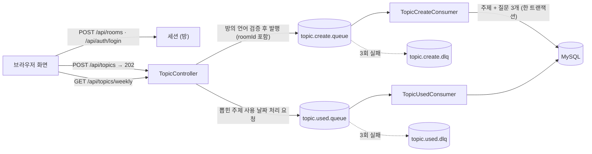

# 🗣️ language-exchange

**한국어** | [日本語](README-ja.md)

**두 사람이 방 하나를 같이 쓰는 언어교환 주제 & 질문 가이드 서비스**

서로의 언어를 배우는 두 사람이 **방(공용 계정)** 을 하나 만들고, 매주 이야기할 **주제를 뽑아** 주제마다 준비한 **질문 3개**로 대화를 이어가는 웹 서비스입니다.

- **방 = 공용 계정**: 개인 계정이 없습니다. 방 아이디와 비밀번호를 두 사람이 같이 쓰고, 각자의 기기에서 같은 방에 들어옵니다.
- **10개 언어**: 한국어, 일본어, 영어, 중국어(간체), 스페인어, 프랑스어, 아랍어, 베트남어, 태국어, 이탈리아어. 방을 만들 때 각자 **배우고 싶은 언어**를 고르면 그 두 언어가 방의 언어가 됩니다.
- **주제와 질문은 방의 두 언어로** 짝지어 저장하고, 화면에서는 두 언어를 나란히 보여주거나 토글로 바꿔 봅니다.
- 한 주(월~일)에 **한 번만** 주제를 뽑습니다. 이번 주에 이미 뽑았다면 같은 주제가 계속 보이고, 아직 안 쓴 주제 중에서만 무작위로 뽑힙니다.
- 지금까지 이야기한 주제는 **회차별 학습 기록**으로 다시 볼 수 있습니다.
- 주제·질문·기록·이번 주 주제는 **방마다 완전히 분리**됩니다.

---

## 🏛️ System Architecture Overview

- **단일 애플리케이션 구조**: Spring Boot 한 개가 REST API와 화면(HTML/CSS/JS)을 함께 제공합니다. 별도의 프론트 서버나 빌드 과정이 없습니다.
- **방 단위 인증**: 방 아이디/비밀번호로 로그인하면 서버 세션에 방이 기록됩니다. 모든 API는 세션의 방을 기준으로 동작하고, URI에는 방 번호가 들어가지 않습니다.
- **비동기 쓰기 구조**: 주제 등록과 "이번 주 주제 사용 처리"는 RabbitMQ를 거쳐 처리합니다. API는 검증만 마치고 `202 Accepted`로 즉시 응답하고, 실제 저장은 Consumer가 담당합니다.
- **실패 대비**: Consumer가 실패하면 최대 3회까지 시도하고, 모두 실패하면 DLQ(Dead Letter Queue)로 보내 메시지가 유실되지 않게 합니다.
- **단일 RDB**: MySQL에 방(`rooms`), 주제(`topics`), 질문(`questions`)을 저장합니다. 여러 언어를 함께 저장하므로 `utf8mb4`를 사용합니다.



---

## 🛠️ Tech Stack

### Backend
- **Java 25 / Spring Boot 4.1** (Spring Framework 7, Hibernate 7, Jackson 3)
- **Spring Security**: 서버 세션 방식. 비밀번호는 BCrypt 해시만 저장합니다.
- **Spring Data JPA & QueryDSL 5.1**: "아직 안 쓴 주제 우선 → 이름순" 정렬을 `CASE` 식으로 작성했습니다. 목록은 `Slice`로 조회해 `count` 쿼리 없이 `hasNext`만 판단합니다.
- **Spring Validation**: 요청 DTO에서 필수값과 형식을 검증합니다.
- **Spring AMQP (RabbitMQ)**: 등록/사용 처리를 비동기화하고, JSON 메시지 컨버터와 재시도·DLQ 구성을 적용했습니다.
- **SpringDoc OpenAPI**: Swagger UI로 API 문서를 자동화했습니다.
- **MySQL 8**

### Frontend
- **Vanilla HTML / CSS / JavaScript**: 프레임워크와 빌드 도구 없이 `static/` 폴더에서 서빙합니다.
- **화면 문구 10개 언어**: 자체 엔진(`i18n.js`)과 언어별 사전 파일. 날짜와 나라 이름은 브라우저의 `Intl` API가 화면 언어에 맞게 만듭니다.
- **Google Fonts**: 한국어 `Gowun Dodum`, 일본어 `Zen Maru Gothic`, 중국어 `Noto Sans SC`. 그 밖의 언어는 기기 기본 글꼴을 씁니다.
- 글자 색은 언어가 아니라 **자리**에 붙습니다: 방의 첫 번째 언어(A)는 **파랑**, 두 번째 언어(B)는 **빨강**.
- **언어별 모티프**: 10개 언어마다 그 문화의 꽃·문양을 직접 그린 SVG로 두고, 두 언어가 만나는 의미로 **겹치는 두 송이**를 상징으로 사용했습니다.

### Infra
- **Docker Compose**: MySQL과 RabbitMQ(관리 콘솔 포함)를 한 번에 실행합니다.
- **환경 변수**: `.env` 파일을 `spring.config.import`로 불러와 DB 계정 정보를 코드 밖에서 관리합니다.

---

## 🔐 인증

| 항목 | 내용 |
|---|---|
| 로그인 주체 | 사람이 아니라 **방**. 같은 방 계정으로 여러 기기가 동시에 로그인할 수 있습니다. |
| 방식 | 서버 세션. 쿠키는 `HttpOnly`, `SameSite=Lax`, 30일 유지 |
| 비밀번호 | BCrypt 해시만 저장. **복구 수단이 없습니다** (이메일 등을 받지 않음). |
| 열려 있는 주소 | 화면 파일(`/`, `*.html`, `favicon.svg`, `css/**`, `js/**`, `img/**`), `POST /api/rooms`, `POST /api/auth/login`, Swagger |
| 그 밖의 요청 | 로그인하지 않으면 `401` (`errorCode: UNAUTHORIZED`). 화면은 `401`을 받으면 `enter.html`로 이동합니다. |
| CSRF | 비활성 + `SameSite=Lax` (외부 공개 전에 재검토) |

세션은 서버 메모리에 있어서 **서버를 재시작하면 다시 로그인**해야 합니다.

---

## 📡 API

### 한눈에 보기 (총 11개)

| # | Method | URI | 설명 | 로그인 | 응답 |
|---|---|---|---|:---:|---|
| 1 | `POST` | `/api/rooms` | 방 만들기 (만들면 바로 로그인) | 불필요 | `201` / `400` / `409` |
| 2 | `GET` | `/api/rooms` | 현재 방 정보 조회 | 필요 | `200` / `401` |
| 3 | `POST` | `/api/auth/login` | 방 아이디/비밀번호 로그인 | 불필요 | `200` / `400` / `401` |
| 4 | `POST` | `/api/auth/logout` | 로그아웃 | 필요 | `200` / `401` |
| 5 | `POST` | `/api/topics` | 주제 1개 + 질문 3개 등록 요청 (비동기) | 필요 | `202` / `400` / `401` |
| 6 | `POST` | `/api/topics/bulk-create` | 주제 여러 개 일괄 등록 요청 (비동기) | 필요 | `202` / `400` / `401` |
| 7 | `GET` | `/api/topics/weekly` | **이번 주 주제 뽑기** (이미 뽑았다면 그 주제) | 필요 | `200` / `401` / `404` |
| 8 | `GET` | `/api/topics/this-week` | 이번 주에 **이미 뽑은** 주제 조회 (뽑지 않음) | 필요 | `200` / `401` |
| 9 | `GET` | `/api/topics` | 전체 주제 목록 (`Slice`) | 필요 | `200` / `401` |
| 10 | `GET` | `/api/topics/history` | 회차별 학습 기록 (`Slice`) | 필요 | `200` / `401` |
| 11 | `GET` | `/api/topics/{topicId}/questions?lang=` | 주제의 질문 3개 (언어 지정) | 필요 | `200` / `400` / `401` / `404` |

- Swagger UI: `http://localhost:8080/swagger-ui.html`
- 모든 API는 `Content-Type: application/json`을 사용하고, 로그인 후에는 세션 쿠키(`JSESSIONID`)가 자동으로 함께 전송됩니다.
- 로그인이 필요한 API를 로그인 없이 부르면 모두 `401 UNAUTHORIZED`입니다. 아래 상세 설명에서는 중복을 피하려고 생략했습니다.
- 모든 `roomId`는 세션에서만 꺼냅니다. 클라이언트가 보낸 값은 받지 않고, URI에도 방 번호가 없습니다.
- 다른 방의 `topicId`는 존재 여부를 숨기려고 `404`로 응답합니다.

### 공통 규칙

**응답 형식** — 성공과 실패 모두 같은 틀을 씁니다. 실패 응답에는 `errorCode`가 들어가고, 화면은 이 값으로 화면 언어에 맞는 문구를 골라 보여줍니다.

```json
{ "success": true, "code": 200, "message": "주제 목록 조회 성공", "data": { } }
```
```json
{ "success": false, "code": 409, "errorCode": "DUPLICATE_ROOM_ID", "message": "이미 사용 중인 방 아이디입니다.", "data": null }
```

| 필드 | 타입 | 설명 |
|---|---|---|
| `success` | boolean | 성공 여부 |
| `code` | number | HTTP 상태 코드와 같은 값 |
| `errorCode` | string | 실패 응답에만 존재 (성공 시에는 필드 자체가 없음) |
| `message` | string | 한국어 설명 (화면은 `errorCode`로 화면 언어 문구를 따로 고름) |
| `data` | object / array / null | 응답 본문. 입력 검증 실패(`INVALID_INPUT`) 때는 문제가 있는 필드 목록(`["loginId: 방 아이디는 영문 소문자·숫자·-·_ 4~20자여야 합니다."]`)이 들어갑니다. |

**언어가 들어가는 값** — 항상 `{ "lang": "KO", "text": "공원" }` 형태입니다. `lang`은 `KO, JA, EN, ZH, ES, FR, AR, VI, TH, IT` 중 하나이고, 응답의 `names`는 방의 첫 번째 언어(A), 두 번째 언어(B) 순서입니다.

**목록(`Slice`) 응답** — `count` 쿼리 없이 다음 페이지 유무만 알려줍니다.

| 필드 | 타입 | 설명 |
|---|---|---|
| `content` | array | 현재 페이지 항목 |
| `page` | number | 현재 페이지 (0부터) |
| `size` | number | 페이지 크기 |
| `hasNext` | boolean | 다음 페이지 존재 여부 |

쿼리 파라미터: `page`(기본 0), `size`(기본 20). `sort`는 정렬이 고정이라 무시됩니다.

---

### 1. 방 만들기 `POST /api/rooms`

방 아이디·비밀번호와 두 사람의 정보로 방을 만들고 **바로 로그인**합니다. (응답에 세션 쿠키가 함께 내려갑니다.)
서로 상대의 언어를 배우는 교환이라, 한 사람이 **쓰는 언어**는 상대가 **배우고 싶은 언어**로 정해집니다. 두 언어는 서로 달라야 합니다.

**Request Body**

| 필드 | 타입 | 필수 | 제약 |
|---|---|:---:|---|
| `loginId` | string | O | 영문 소문자·숫자·`-`·`_` 4~20자. 중복 불가 |
| `password` | string | O | 영문·숫자·기호(ASCII) 8~64자 (BCrypt 72바이트 한계 때문에 ASCII만 허용) |
| `members` | array | O | 정확히 2개: **[첫 번째 사람(A), 두 번째 사람(B)]** 순서 |
| `members[].name` | string | O | 50자 이하, 공백만으로는 불가 |
| `members[].nationality` | string | O | ISO 3166-1 alpha-2 국가 코드 (`KR`, `JP` …). 실제 코드인지 서비스에서 한 번 더 확인 |
| `members[].learningLanguage` | string | O | 이 사람이 배우고 싶은 언어 (`Language` 값) |

```json
{
  "loginId": "our-room",
  "password": "password123",
  "members": [
    { "name": "민수", "nationality": "KR", "learningLanguage": "JA" },
    { "name": "ゆい", "nationality": "JP", "learningLanguage": "KO" }
  ]
}
```

위 요청이면 첫 번째 사람(A)은 한국어(KO), 두 번째 사람(B)은 일본어(JA)를 씁니다.

**Response `201 Created`**

```json
{ "success": true, "code": 201, "message": "방이 만들어졌습니다.", "data": null }
```

**실패**

| errorCode | HTTP | 상황 |
|---|---|---|
| `INVALID_INPUT` | 400 | 필수값 누락, 형식 오류(아이디·비밀번호 규칙, `members`가 2개가 아님), 없는 언어 코드 |
| `SAME_LANGUAGE` | 400 | 두 사람이 같은 언어를 배우겠다고 고름 |
| `INVALID_NATIONALITY` | 400 | 국적이 실제 ISO 국가 코드가 아님 |
| `DUPLICATE_ROOM_ID` | 409 | 이미 있는 방 아이디 |

---

### 2. 현재 방 정보 `GET /api/rooms`

로그인한 방의 아이디와 두 사람의 이름·국적·쓰는 언어(`language`)·배우고 싶은 언어(`learningLanguage`)를 돌려줍니다. `members`는 항상 [A, B] 순서입니다. 화면은 이 응답으로 방의 두 언어와 모티프를 정합니다.

**Response `200 OK`**

```json
{
  "success": true,
  "code": 200,
  "message": "방 정보 조회 성공",
  "data": {
    "loginId": "our-room",
    "members": [
      { "name": "민수", "nationality": "KR", "language": "KO", "learningLanguage": "JA" },
      { "name": "ゆい", "nationality": "JP", "language": "JA", "learningLanguage": "KO" }
    ]
  }
}
```

**실패**

| errorCode | HTTP | 상황 |
|---|---|---|
| `UNAUTHORIZED` | 401 | 로그인하지 않음 |
| `ROOM_NOT_FOUND` | 401 | 세션은 있는데 방이 없음 (다시 로그인 필요) |

---

### 3. 로그인 `POST /api/auth/login`

방 아이디와 비밀번호로 로그인합니다. 성공하면 세션 쿠키(`HttpOnly`, `SameSite=Lax`, 30일)가 발급됩니다. 같은 방 계정으로 여러 기기가 동시에 로그인할 수 있습니다.

**Request Body**

| 필드 | 타입 | 필수 | 제약 |
|---|---|:---:|---|
| `loginId` | string | O | 공백 불가 |
| `password` | string | O | 공백 불가 |

```json
{ "loginId": "our-room", "password": "password123" }
```

**Response `200 OK`**

```json
{ "success": true, "code": 200, "message": "로그인 성공", "data": null }
```

**실패**

| errorCode | HTTP | 상황 |
|---|---|---|
| `INVALID_INPUT` | 400 | 아이디나 비밀번호가 비어 있음 |
| `INVALID_CREDENTIALS` | 401 | 아이디 또는 비밀번호가 틀림 (**어느 쪽이 틀렸는지 구분하지 않음**) |

---

### 4. 로그아웃 `POST /api/auth/logout`

현재 세션을 끝냅니다. 요청 본문은 없습니다. 다른 기기에서 같은 방으로 로그인한 세션은 영향을 받지 않습니다.

**Response `200 OK`**

```json
{ "success": true, "code": 200, "message": "로그아웃 성공", "data": null }
```

**실패**: 로그인하지 않았으면 `401 UNAUTHORIZED`.

---

### 5. 주제 1개 + 질문 3개 등록 `POST /api/topics`

로그인한 방에 주제 1개와 질문 3개를 등록합니다. 검증만 마치고 큐(`topic.create.queue`)에 넣은 뒤 **즉시 `202`** 로 응답하고, 실제 저장은 Consumer가 비동기로 처리합니다. 주제 1개와 질문 3개는 **한 메시지·한 트랜잭션**이라, 하나라도 저장에 실패하면 전부 취소됩니다.

**Request Body**

| 필드 | 타입 | 필수 | 제약 |
|---|---|:---:|---|
| `names` | array | O | 정확히 2개. **방의 두 언어가 하나씩** (순서는 상관없음) |
| `names[].lang` | string | O | `Language` 값 |
| `names[].text` | string | O | 공백 불가, 255자 이하 |
| `questions` | array | O | **정확히 3개** (순서가 `sequence` 1~3이 됨) |
| `questions[].contents` | array | O | 정확히 2개. 질문 하나를 **방의 두 언어로 하나씩** |
| `questions[].contents[].lang` | string | O | `Language` 값 |
| `questions[].contents[].text` | string | O | 공백 불가, 255자 이하 |

```json
{
  "names": [
    { "lang": "KO", "text": "공원" },
    { "lang": "JA", "text": "公園" }
  ],
  "questions": [
    { "contents": [ { "lang": "KO", "text": "좋아하는 공원에 대해 설명해주세요." }, { "lang": "JA", "text": "好きな公園について説明してください。" } ] },
    { "contents": [ { "lang": "KO", "text": "공원에 가면 주로 무엇을 하나요?" }, { "lang": "JA", "text": "公園に行ったら、主に何をしますか？" } ] },
    { "contents": [ { "lang": "KO", "text": "최근에 공원에 간 경험을 말해주세요." }, { "lang": "JA", "text": "最近公園に行った経験を話してください。" } ] }
  ]
}
```

**Response `202 Accepted`**

```json
{ "success": true, "code": 202, "message": "주제 등록 요청이 접수되었습니다.", "data": null }
```

> `202`는 "접수"이지 "저장 완료"가 아닙니다. 저장이 끝난 주제는 `GET /api/topics`에 나타납니다.

**실패**

| errorCode | HTTP | 상황 |
|---|---|---|
| `INVALID_INPUT` | 400 | 필수값 누락, 255자 초과, `names`/`contents`가 2개가 아님, `questions`가 3개가 아님(DTO 검증), 없는 언어 코드 |
| `INVALID_QUESTION_COUNT` | 400 | 질문이 3개가 아님 (서비스 단계 방어 검사) |
| `LANGUAGE_NOT_IN_ROOM` | 400 | 방의 두 언어가 아닌 언어를 썼거나, 같은 언어를 두 번 씀 |

---

### 6. 주제 여러 개 일괄 등록 `POST /api/topics/bulk-create`

주제 여러 개를 한 번에 등록 요청합니다. 각 주제의 형식은 5번과 같고, **주제 1개당 메시지 1개**로 나뉘어 처리됩니다. 한 주제가 저장에 실패해도 나머지는 저장되며, **큐에 넣기 전에 전체 입력을 먼저 검증**해서 형식이 틀린 주제가 하나라도 있으면 전부 거절합니다.

**Request Body**

| 필드 | 타입 | 필수 | 제약 |
|---|---|:---:|---|
| `topics` | array | O | 1개 이상. 각 항목은 5번의 Request Body와 동일 |

```json
{
  "topics": [
    {
      "names": [ { "lang": "KO", "text": "공원" }, { "lang": "JA", "text": "公園" } ],
      "questions": [
        { "contents": [ { "lang": "KO", "text": "질문 1" }, { "lang": "JA", "text": "質問1" } ] },
        { "contents": [ { "lang": "KO", "text": "질문 2" }, { "lang": "JA", "text": "質問2" } ] },
        { "contents": [ { "lang": "KO", "text": "질문 3" }, { "lang": "JA", "text": "質問3" } ] }
      ]
    },
    {
      "names": [ { "lang": "KO", "text": "여행" }, { "lang": "JA", "text": "旅行" } ],
      "questions": [ "… 같은 형식 3개 …" ]
    }
  ]
}
```

**Response `202 Accepted`**

```json
{ "success": true, "code": 202, "message": "주제 일괄 등록 요청이 접수되었습니다.", "data": null }
```

**실패**: 5번과 같습니다. `topics`가 비어 있으면 `INVALID_INPUT`.

---

### 7. 이번 주 주제 뽑기 `GET /api/topics/weekly`

이번 주(월~일)에 이미 뽑은 주제가 있으면 **그 주제를 그대로** 돌려줍니다. 없으면 로그인한 방의 **아직 안 쓴 주제 중 무작위 1개**를 뽑아 돌려주고, 그 주제의 사용 날짜를 채우는 요청을 `topic.used.queue`에 비동기로 보냅니다.

- 다음 주가 되면 다시 새 주제를 뽑을 수 있습니다.
- 뽑지 않고 이미 뽑았는지만 확인하려면 8번(`this-week`)을 쓰세요.

**Response `200 OK`**

```json
{
  "success": true,
  "code": 200,
  "message": "주제 조회 성공",
  "data": {
    "id": 5,
    "names": [ { "lang": "KO", "text": "공원" }, { "lang": "JA", "text": "公園" } ]
  }
}
```

**실패**

| errorCode | HTTP | 상황 |
|---|---|---|
| `NO_AVAILABLE_TOPIC` | 404 | 뽑을 수 있는 안 쓴 주제가 없음 (주제를 더 등록해야 함) |

---

### 8. 이번 주에 이미 뽑은 주제 `GET /api/topics/this-week`

이번 주에 뽑은 주제가 있으면 돌려주고, **없으면 `data`가 `null`** 입니다. 주제를 뽑지도, 사용 처리하지도 않습니다. 화면은 이 API로 홈이 열릴 때 불필요한 "뽑기" 버튼을 숨깁니다.

**Response `200 OK` — 뽑은 주제가 있을 때**

```json
{
  "success": true,
  "code": 200,
  "message": "이번 주 주제 조회 성공",
  "data": {
    "id": 5,
    "names": [ { "lang": "KO", "text": "공원" }, { "lang": "JA", "text": "公園" } ]
  }
}
```

**Response `200 OK` — 아직 안 뽑았을 때**

```json
{ "success": true, "code": 200, "message": "이번 주 주제 조회 성공", "data": null }
```

---

### 9. 전체 주제 목록 `GET /api/topics`

사용 여부와 관계없이 방의 전체 주제를 `Slice`로 돌려줍니다. **정렬은 고정**입니다: 아직 안 쓴 주제 먼저, 같은 그룹 안에서는 방의 첫 번째 언어(A) 이름순. `usedDate`가 `null`이면 아직 안 쓴 주제입니다.

**Query Parameters**: `page`(기본 0), `size`(기본 20)

**Response `200 OK`**

```json
{
  "success": true,
  "code": 200,
  "message": "주제 목록 조회 성공",
  "data": {
    "content": [
      { "id": 7, "names": [ { "lang": "KO", "text": "여행" }, { "lang": "JA", "text": "旅行" } ], "usedDate": null },
      { "id": 5, "names": [ { "lang": "KO", "text": "공원" }, { "lang": "JA", "text": "公園" } ], "usedDate": "2026-10-08" }
    ],
    "page": 0,
    "size": 20,
    "hasNext": false
  }
}
```

---

### 10. 회차별 학습 기록 `GET /api/topics/history`

언어교환에 쓴 주제를 **1회차부터** 순서대로 돌려줍니다. 회차는 달력의 몇째 주가 아니라 **뽑은 순서**입니다. 처음 뽑은 주제가 1회차이고, 한 주를 건너뛰어도 회차는 빈칸 없이 이어집니다. 회차는 DB에 저장하지 않고 사용 날짜 오름차순 결과의 순서로 조회할 때 계산합니다. 각 항목의 `id`로 11번을 호출하면 그 주제의 질문을 다시 볼 수 있습니다.

**Query Parameters**: `page`(기본 0), `size`(기본 20)

**Response `200 OK`**

```json
{
  "success": true,
  "code": 200,
  "message": "주차별 학습 기록 조회 성공",
  "data": {
    "content": [
      {
        "id": 5,
        "round": 1,
        "names": [ { "lang": "KO", "text": "공원" }, { "lang": "JA", "text": "公園" } ],
        "usedDate": "2026-10-08"
      }
    ],
    "page": 0,
    "size": 20,
    "hasNext": false
  }
}
```

---

### 11. 주제의 질문 3개 `GET /api/topics/{topicId}/questions?lang=`

지정한 주제의 질문 3개를 **한 언어로** 돌려줍니다. 화면의 언어 토글은 이 API를 `lang`만 바꿔 다시 부르는 방식입니다.

**Path / Query Parameters**

| 이름 | 위치 | 필수 | 설명 |
|---|---|:---:|---|
| `topicId` | path | O | 주제 번호 |
| `lang` | query | O | **방의 두 언어 중 하나** (예: `KO`, `JA`) |

**Response `200 OK`** — `GET /api/topics/5/questions?lang=JA`

```json
{
  "success": true,
  "code": 200,
  "message": "질문 조회 성공",
  "data": {
    "topicId": 5,
    "language": "JA",
    "questions": [
      { "sequence": 1, "content": "好きな公園について説明してください。" },
      { "sequence": 2, "content": "公園に行ったら、主に何をしますか？" },
      { "sequence": 3, "content": "最近公園に行った経験を話してください。" }
    ]
  }
}
```

**실패**

| errorCode | HTTP | 상황 |
|---|---|---|
| `INVALID_INPUT` | 400 | `lang`을 빼먹음, 없는 언어 코드(`lang=XX`), `topicId`가 숫자가 아님 |
| `LANGUAGE_NOT_IN_ROOM` | 400 | 존재하는 언어지만 이 방의 두 언어가 아님 |
| `TOPIC_NOT_FOUND` | 404 | 주제가 없거나 **다른 방의 주제** (존재 여부를 숨기려고 같은 응답) |

---

### 전체 errorCode

| errorCode | HTTP | 상황 |
|---|---|---|
| `INVALID_INPUT` | 400 | 필수값 누락, 형식 오류, 잘못된 JSON·언어 코드, `lang` 누락 |
| `SAME_LANGUAGE` | 400 | 두 사람이 같은 언어를 배우겠다고 고름 |
| `INVALID_NATIONALITY` | 400 | 국적이 ISO 3166-1 alpha-2 국가 코드가 아님 |
| `LANGUAGE_NOT_IN_ROOM` | 400 | 방의 두 언어가 아닌 언어로 등록·조회 |
| `INVALID_QUESTION_COUNT` | 400 | 질문이 3개가 아님 |
| `UNAUTHORIZED` | 401 | 로그인하지 않음 |
| `INVALID_CREDENTIALS` | 401 | 방 아이디 또는 비밀번호가 틀림 (둘을 구분하지 않음) |
| `ROOM_NOT_FOUND` | 401 | 세션은 있는데 방이 없음 (다시 로그인 필요) |
| `ACCESS_DENIED` | 403 | 권한 없음 |
| `TOPIC_NOT_FOUND` | 404 | 주제가 없거나 다른 방의 주제 |
| `NO_AVAILABLE_TOPIC` | 404 | 뽑을 수 있는 안 쓴 주제가 없음 |
| `NOT_FOUND` | 404 | 없는 주소 |
| `DUPLICATE_ROOM_ID` | 409 | 이미 있는 방 아이디 |
| `INTERNAL_SERVER_ERROR` | 500 | 예상하지 못한 오류 |

### 비동기 메시지 (RabbitMQ)

API 응답과 별개로 서버 안에서 오가는 메시지입니다.

| Exchange | Queue | Routing Key | DLQ | 발행하는 API | 처리 내용 |
|---|---|---|---|---|---|
| `topic.exchange` | `topic.create.queue` | `topic.create` | `topic.create.dlq` | `POST /api/topics`, `POST /api/topics/bulk-create` | 주제 1개 + 질문 3개를 한 트랜잭션으로 저장 (메시지에 `roomId` 포함) |
| `topic.exchange` | `topic.used.queue` | `topic.used` | `topic.used.dlq` | `GET /api/topics/weekly` | 뽑힌 주제의 사용 날짜(`used_date`) 기록 |

- Consumer는 2초 → 4초 간격으로 **최대 3회** 시도하고, 모두 실패하면 DLQ(`topic.dlx`)로 이동합니다.
- Consumer는 같은 메시지가 두 번 와도 결과가 같도록 작성했습니다(멱등).

---

## 🖥️ Frontend 화면

서버를 켠 뒤 `http://localhost:8080` 에서 바로 사용할 수 있습니다. 폰·PC 화면 모두 지원합니다.

| 페이지 | 파일 | 설명 |
|---|---|---|
| 들어가기 | `enter.html` | **로그인 / 방 만들기** 탭. 방 만들기에서는 방 아이디·비밀번호와 두 사람의 이름·국적·배우고 싶은 언어를 한 화면에 입력합니다. |
| 홈 | `index.html` | 이번 주 주제 뽑기. 이미 뽑았다면 버튼 없이 바로 주제를 보여주고 다음에 뽑을 수 있는 날짜를 안내합니다. 카드를 누르면 질문이 열립니다. |
| 전체 주제 | `topics.html` | 등록된 모든 주제. "아직 안 쓴 주제 / 사용한 주제" 그룹으로 나뉘며 `더 보기`로 이어서 불러옵니다. |
| 학습 기록 | `history.html` | 1회차부터 지금까지 이야기한 주제 목록. 이번 주 기록은 강조됩니다. |
| 주제 등록 | `register.html` | 주제와 질문 3개를 방의 두 언어로 짝지어 입력. **하나씩 / 여러 개씩** 방식을 선택할 수 있습니다. |

- **공통 헤더**: 로고, 메뉴, 화면 언어 선택, 로그아웃은 `common.js`가 모든 페이지에 그립니다. HTML에는 빈 `<header>`만 있습니다.
- **질문 시트**: 주제를 누르면 질문 3개가 열리고, 방의 두 언어 토글로 언어를 바꿉니다. 마지막으로 고른 언어는 방별로 브라우저에 기억됩니다.
- **입력 검증**: 빈 칸이 있으면 전송하지 않고 해당 칸을 표시합니다. 글자 수는 DB 컬럼 길이(255자)에 맞춰 제한했습니다.

### 다국어

두 가지 언어를 구분합니다.

| | 무엇 | 어떻게 정해지나 |
|---|---|---|
| **방의 언어** | 주제·질문 내용을 쓰는 두 언어 | 방을 만들 때 각자 고른 "배우고 싶은 언어" |
| **화면 언어** | 메뉴·버튼·안내 문구 | ① 헤더에서 직접 고른 값(브라우저에 저장) → ② 브라우저 언어 → ③ 영어. 방의 언어와 무관하고, 한 기기에서는 한 언어만 보여줍니다. |

- `js/languages.js`: 10개 언어의 메타데이터(그 언어로 쓴 이름, HTML `lang` 값, 글 방향, 화면 언어로 쓸 수 있는지, 모티프 그림과 보조 색). 언어 정보는 여기 한 곳에서만 관리하고, 다른 코드에서는 언어 코드로 분기하지 않습니다.
- `js/i18n.js`: 화면 문구 엔진. HTML에는 `data-i18n="home.hero.title"`처럼 키만 쓰고, `t('register.topicNo', { no: 1 })`처럼 값을 넣을 수 있습니다. 화면 언어를 바꾸면 새로고침 없이 바뀝니다.
- `js/i18n/*.js`: 언어별 사전 10개 (`ko`, `ja`, `en`, `zh`, `es`, `fr`, `ar`, `vi`, `th`, `it`). 키 구성은 모두 같고, 빠진 키는 영어로 보여줍니다.
  한국어·일본어·영어 외의 사전은 **AI 번역 초안**이며 원어민 검수가 필요합니다.
- **서버 오류**는 응답의 `errorCode`로 사전의 `error.<errorCode>` 문구를 찾아 화면 언어로 보여줍니다.
- **아랍어(RTL)**: 화면 언어가 아랍어면 `<html dir="rtl">`로 바뀌고, 여백·위치는 CSS 논리 속성(`margin-inline-*`, `inset-inline-*`)으로 써서 좌우가 뒤집힙니다.
- 사용자가 입력한 주제·질문은 번역하지 않고, 내용의 실제 언어로 `lang`/`dir` 속성을 붙입니다.

### 언어별 모티프

언어마다 그 문화를 담은 장식 그림(모티프)이 하나씩 있습니다.

| 언어 | 모티프 | 언어 | 모티프 |
|---|---|---|---|
| 한국어 | 무궁화 | 프랑스어 | 아이리스 |
| 일본어 | 벚꽃 | 아랍어 | 재스민과 여덟 꼭지 별 문양 |
| 영어 | 튜더 로즈 | 베트남어 | 연꽃 |
| 중국어 | 모란 | 태국어 | 라차프르욱(황금비 나무 꽃) |
| 스페인어 | 붉은 카네이션 | 이탈리아어 | 흰 백합 |

- **데이터**: `languages.js`의 `motif`(SVG 경로)와 `accent`(그 그림에 어울리는 보조 색). 그림은 `static/img/motif/<언어>.svg`에 직접 그린 단순 벡터로 하나씩 있습니다.
- **적용**: `common.js`의 `applyMotifs()`가 CSS 변수 `--motif-a/b`(그림), `--accent-a/b`(보조 색)와 `<html data-motifs="pair|single">`을 설정합니다. CSS는 이 변수만 쓰고 어떤 언어인지는 모릅니다.
- **어디에 무엇이 나오나**
    - 방에 들어가기 전(`enter.html`): **화면 언어**의 모티프 하나 — 헤더 마크, 제목 옆, 배경 원의 색. 화면 언어를 바꾸면 같이 바뀝니다.
    - 방 안: **방의 두 언어(A, B)** 의 모티프를 나란히 — 헤더 마크, 주제 카드의 두 송이, 배경 원의 색, 빈 목록 화면(`createMotifPair()`가 만드는 한 쌍). 화면 언어를 바꿔도 바뀌지 않습니다.
- **색**: 모티프는 자기 색을 가진 장식이고, 자리(A 파랑 / B 빨강) 글자 색과는 독립입니다. 예를 들어 일본어가 A 자리인 방에서는 벚꽃은 분홍, 글자는 파랑입니다.
- 장식에는 `aria-hidden="true"`를 달아 화면 낭독기가 읽지 않습니다.

### 언어를 추가하려면

세 가지를 더하면 됩니다. ① `js/languages.js`에 메타데이터 한 줄(이름, `tag`, `dir`, `ui`, `motif`, `accent`) ② `static/img/motif/<언어>.svg` 모티프 그림 하나 ③ 화면 언어로도 쓰려면 `js/i18n/<언어>.js` 사전 하나(키는 다른 사전과 같게, 없으면 `ui: false`로 두고 영어 화면을 씁니다). 주제·질문 내용의 언어로 쓰려면 서버의 `Language` enum에도 같은 이름의 값을 추가합니다. 그 밖의 JS·CSS는 고치지 않습니다.

---

## 🚀 Key Design Points

1. **방마다 언어 2칸 (A/B 슬롯)**
    - 언어가 10개여도 방은 항상 두 언어만 쓰므로, 번역 테이블 없이 `name_a`/`name_b`, `content_a`/`content_b` 두 칸에 저장합니다.
    - A/B는 DB 안에서만 쓰는 표현입니다. API는 `{lang, text}`로 풀어서 주고받고, 서비스가 방의 언어와 맞는지 검증합니다.
    - A = 첫 번째 사람이 쓰는 언어(= 두 번째 사람이 배우고 싶은 언어), B = 두 번째 사람이 쓰는 언어.
2. **방 격리**
    - 방이 소유하는 데이터를 읽는 모든 쿼리에 `roomId` 조건이 들어갑니다. `roomId`는 세션에서만 꺼내고 클라이언트가 보낸 값은 받지 않습니다.
3. **회차(Round) 계산**
    - 달력의 몇째 주가 아니라 **뽑은 순서**로 셉니다. 처음 뽑은 주제가 1회차이고, 한 주를 건너뛰어도 회차는 빈칸 없이 이어집니다.
    - 회차는 DB에 저장하지 않고, 사용 날짜 오름차순 조회 결과의 순서로 조회 시점에 계산합니다.
4. **한 주 한 번 뽑기 규칙**
    - 주(월~일)를 기준으로 이번 주에 사용 처리된 주제가 있으면 그대로 반환합니다. 이미 뽑았는지는 `GET /api/topics/this-week`로 **뽑지 않고** 확인할 수 있어, 화면이 열릴 때 불필요한 뽑기 버튼을 숨깁니다.
5. **비동기 등록과 원자성**
    - 주제 1개와 질문 3개는 한 메시지, 한 트랜잭션으로 저장합니다. 질문 하나라도 저장에 실패하면 주제까지 롤백됩니다.
    - 여러 개 등록은 주제 1개당 메시지 1개로 나누어, 한 주제가 실패해도 나머지는 저장됩니다. 큐에 넣기 전에 전체 입력을 먼저 검증합니다.
6. **재시도와 DLQ**
    - Consumer는 2초 → 4초 간격으로 최대 3회 시도하고, 모두 실패하면 DLQ(`topic.create.dlq`, `topic.used.dlq`)로 이동합니다.
7. **일관된 코드 컨벤션**
    - `Request → Command → Result → Response` DTO 계층 분리, `Service`(쓰기) / `QueryService`(조회, `readOnly`) 분리, 엔티티는 `create()` 정적 팩토리로 생성, 공통 응답 `ApiResponse` / `SliceResponse`를 사용합니다.

---

## 📁 Project Structure

```
exchange
├── docker-compose.yml           # MySQL, RabbitMQ
├── .env.example                 # 환경 변수 예시 (실제 .env는 커밋하지 않음)
├── build.gradle
└── src
    ├── main
    │   ├── java/language/exchange
    │   │   ├── ExchangeApplication.java
    │   │   ├── global
    │   │   │   ├── config           # documentation, querydsl, rabbitmq, security
    │   │   │   ├── constants        # StudyConstants, RabbitMQConstants
    │   │   │   ├── domain           # BaseTimeEntity
    │   │   │   ├── dto/response     # ApiResponse, SliceResponse
    │   │   │   ├── exception        # ErrorCode, BusinessException, GlobalExceptionHandler
    │   │   │   └── util             # SliceUtil, WeekUtils
    │   │   ├── auth                 # 로그인·로그아웃 (AuthController, AuthService)
    │   │   ├── room                 # 방 만들기·방 정보 (Room, Language, RoomService, RoomQueryService)
    │   │   └── study                # 주제·질문
    │   │       ├── controller       # TopicController
    │   │       ├── domain           # Topic, Question
    │   │       ├── dto              # request / command / result / response
    │   │       ├── repository       # TopicRepository (+ QueryDSL custom/impl), QuestionRepository
    │   │       ├── service          # TopicService(쓰기), TopicQueryService(조회)
    │   │       ├── event            # 큐로 보내는 메시지 객체
    │   │       ├── publisher        # 메시지 발행
    │   │       └── consumer         # 메시지 수신·처리
    │   └── resources
    │       ├── application.yml      # 공통 설정
    │       ├── application-dev.yml  # 개발용 (기본)
    │       ├── application-prod.yml # 배포용
    │       └── static
    │           ├── enter.html / index.html / topics.html / history.html / register.html
    │           ├── favicon.svg
    │           ├── css/style.css
    │           ├── img/motif/       # 언어별 모티프 SVG 10개
    │           └── js
    │               ├── common.js    # API 래퍼, 공통 헤더, 방 정보, 401 처리, 모티프 적용
    │               ├── languages.js # 지원 언어 메타데이터 (이름, 방향, 모티프, 보조 색)
    │               ├── i18n.js      # 화면 문구 엔진
    │               ├── i18n/        # 언어별 사전 10개
    │               ├── sheet.js     # 질문 시트
    │               └── enter.js / home.js / topics.js / history.js / register.js
    └── test
        ├── java/language/exchange   # RoomServiceTest, TopicRoomIsolationTest
        └── resources/application-test.yml
```

### 데이터 모델

| 테이블 | 주요 컬럼 |
|---|---|
| `rooms` | `id`, `login_id`(유니크), `password_hash`, `language_a`, `language_b`, `a_name`, `a_nationality`, `b_name`, `b_nationality`, `created_at`, `updated_at` |
| `topics` | `id`, `room_id`, `name_a`, `name_b`, `used_date`(사용 날짜, null이면 아직 안 쓴 주제), `created_at`, `updated_at` · 인덱스 `(room_id, used_date)` |
| `questions` | `id`, `topic_id`(FK), `sequence`(1~3, `topic_id`와 함께 유니크), `content_a`, `content_b`, `created_at`, `updated_at` |

- `Question`이 `Topic`을 참조하는 **단방향** 연관관계입니다. `Topic`은 다른 도메인인 방을 엔티티가 아니라 `room_id` 값으로만 참조합니다.
- 국적은 ISO 3166-1 alpha-2 국가 코드로 저장하고, 화면에서는 `Intl.DisplayNames`로 화면 언어의 나라 이름을 보여줍니다.

---

## ▶️ Getting Started

**필요한 것**: JDK 25, Docker Desktop

**1. 환경 변수 만들기** — `.env.example`을 `.env`로 복사해 값을 채웁니다. (`.env`는 커밋하지 않습니다.)

```env
MYSQL_ROOT_PASSWORD=
MYSQL_DATABASE=exchange
MYSQL_USER=
MYSQL_PASSWORD=
```

**2. MySQL, RabbitMQ 실행**

```bash
docker compose up -d
docker compose ps        # 둘 다 healthy 가 될 때까지 대기
```

**3. 애플리케이션 실행**

```bash
./gradlew bootRun
```

| 주소 | 설명 |
|---|---|
| `http://localhost:8080` | 화면 (로그인 전이면 `enter.html`로 이동) |
| `http://localhost:8080/swagger-ui.html` | Swagger UI |
| `http://localhost:15672` | RabbitMQ 관리 콘솔 (로컬 기본 계정) |

처음에는 방이 없으므로 **방 만들기**로 방을 만들고, **주제 등록** 페이지에서 주제를 먼저 등록해 주세요.

### 프로파일

| 프로파일 | 언제 | 차이 |
|---|---|---|
| `dev` (기본) | `./gradlew bootRun` | 정적 파일 캐시 끔, SQL 로그 출력 |
| `prod` | `SPRING_PROFILES_ACTIVE=prod` | 세션 쿠키 `Secure` (HTTPS 전제) |
| `test` | 테스트 | 메모리 DB(H2, MySQL 모드), 큐에 연결하지 않음 |

### 테스트

```bash
./gradlew clean test
```

Docker 없이 실행됩니다. 방 격리(다른 방의 주제·기록·이번 주 주제가 보이지 않는지), 방 만들기 규칙, 비밀번호 해시를 확인합니다.

### 스키마를 바꿨을 때

개발 단계에서는 `ddl-auto: update`를 씁니다. 컬럼 이름이나 구조를 바꾸면 자동으로 반영되지 않으므로 DB를 초기화합니다.

```bash
docker compose down -v && docker compose up -d
```

> **이전 버전(방 계정이 없던 `main`)에서 넘어올 때도 한 번은 초기화해야 합니다.** 테이블 구조가 달라져서(`rooms` 추가, `topics.room_id`, `name_ko/name_ja` → `name_a/name_b` 등) 예전 DB로는 실행되지 않습니다. 위 명령은 저장된 주제·질문을 모두 지웁니다.

---

## 📝 Notes

- **이번 주 주제를 두 사람이 거의 동시에 뽑으면** 서로 다른 주제가 뽑혀 그 주에 주제가 2개 기록될 수 있습니다 (사용 처리가 비동기라서). 이 경우 화면에는 먼저 사용 처리된 주제가 보입니다.
- 방 비밀번호는 복구할 수 없고, 방 정보(이름·국적·언어)와 주제를 수정·삭제하는 기능은 아직 없습니다.
- 외부에 공개하기 전에 필요한 일: 비밀번호 변경, 로그인 시도 제한, CSRF 재검토, HTTPS와 쿠키 `Secure`, 세션 저장소, 번역 원어민 검수.

## About

언어교환 파트너와 실제로 사용하기 위해 만든 개인 프로젝트입니다.