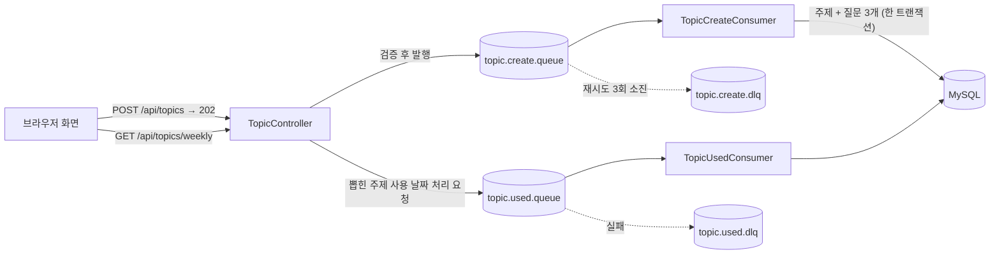

# 🗣️ language-exchange
**한국어 ↔ 일본어 언어교환 주제 & 질문 가이드 서비스**

매주 언어교환에서 이야기할 **주제를 뽑고**, 주제마다 준비된 **질문 3개(한국어/일본어)** 로 대화를 이어가는 서비스입니다.
한국어를 쓰는 사람과 일본어를 쓰는 사람, 두 사람이 실제로 함께 쓰기 위해 만든 개인 프로젝트입니다.

- 주제 이름과 질문이 모두 **한국어/일본어 쌍**으로 저장되고, 화면에서는 한국어·일본어를 병기하거나 토글로 전환해 볼 수 있습니다.
- 한 주(월~일)에 **한 번만** 주제를 뽑습니다. 이번 주에 이미 뽑았다면 같은 주제가 계속 보이고, 아직 안 쓴 주제 중에서만 랜덤으로 뽑힙니다.
- 지금까지 이야기한 주제는 **회차별 학습 기록**으로 다시 볼 수 있고, 기록에서 그때의 질문을 다시 열어볼 수 있습니다.

---

## 🏛️ System Architecture Overview

- **단일 애플리케이션 구조**: Spring Boot 한 개가 REST API와 화면(HTML/CSS/JS)을 함께 제공합니다. 별도의 프론트 서버나 빌드 과정이 없어 CORS 설정과 배포 구성이 단순합니다.
- **비동기 쓰기 구조**: 주제 등록과 "이번 주 주제 사용 처리"는 RabbitMQ를 거쳐 처리합니다. API는 검증만 마치고 `202 Accepted`로 즉시 응답하고, 실제 저장은 Consumer가 담당합니다.
- **실패 대비**: Consumer가 실패하면 자동으로 재시도(최대 3회)하고, 모두 실패하면 DLQ(Dead Letter Queue)로 보내 메시지가 유실되지 않게 합니다.
- **단일 RDB**: MySQL에 주제(`topics`)와 질문(`questions`)을 저장합니다. 한국어와 일본어를 함께 저장하므로 `utf8mb4`를 사용합니다.



---

## 🛠️ Tech Stack & Architecture Justification

### Backend
- **Java 25 / Spring Boot 4.1** (Spring Framework 7, Hibernate 7): 최신 런타임 환경 기반으로 구성했습니다.
- **Spring Data JPA & QueryDSL 5.1**: "아직 안 쓴 주제 우선 → 한국어 가나다순" 정렬을 `CASE` 식으로 타입 안전하게 작성했습니다. 목록은 `Slice`로 조회해 `count` 쿼리 없이 `hasNext`만 판단합니다.
- **Spring Validation**: 요청 DTO에서 주제 이름·질문 필수값과 "질문은 정확히 3개" 규칙을 사전에 검증합니다.
- **Spring AMQP (RabbitMQ)**: 등록/사용 처리를 비동기화하고, JSON 메시지 컨버터와 재시도·DLQ 구성을 적용했습니다.
- **SpringDoc OpenAPI**: Swagger UI로 API 문서를 자동화했습니다.
- **MySQL 8**: 주제와 질문 저장. 한/일 동시 저장을 위해 `utf8mb4`를 사용합니다.

### Frontend
- **Vanilla HTML / CSS / JavaScript**: 프레임워크와 빌드 도구 없이 `static/` 폴더에서 서빙합니다.
- **Google Fonts**: 한국어 `Gowun Dodum`, 일본어 `Zen Maru Gothic`.
- 한국어는 **파랑**, 일본어는 **빨강**으로 앱 전체의 색 규칙을 통일했고, 두 언어가 만나는 의미로 **겹치는 두 송이 꽃**(무궁화 · 벚꽃)을 상징으로 사용했습니다.

### Infra
- **Docker Compose**: MySQL과 RabbitMQ(관리 콘솔 포함)를 한 번에 실행합니다.
- **환경 변수**: `.env` 파일을 `spring.config.import`로 불러와 DB 계정 정보를 코드 밖에서 관리합니다.

---

## 📡 API

모든 응답은 공통 형식을 사용합니다.

```json
{ "success": true, "code": 200, "message": "주제 목록 조회 성공", "data": { } }
```

| Method | URI | 설명 | 응답 |
|---|---|---|---|
| `POST` | `/api/topics` | 주제 1개 + 질문 3개(한/일) 등록 요청 | `202` |
| `POST` | `/api/topics/bulk-create` | 주제 여러 개를 한 번에 등록 요청 (주제마다 질문 3개) | `202` |
| `GET` | `/api/topics/weekly` | **이번 주 주제 뽑기.** 이번 주에 이미 뽑았다면 그 주제, 아니면 안 쓴 주제 중 랜덤 1개 | `200` / `404` |
| `GET` | `/api/topics/this-week` | 이번 주에 **이미 뽑은** 주제 조회 (뽑지 않음, 없으면 `data: null`) | `200` |
| `GET` | `/api/topics` | 전체 주제 목록 (`Slice`). 안 쓴 주제 우선 → 한국어 가나다순 | `200` |
| `GET` | `/api/topics/history` | 회차별 학습 기록 (`Slice`). 1회차부터 최신 순서 | `200` |
| `GET` | `/api/topics/{topicId}/questions?lang=KO\|JA` | 주제의 질문 3개 조회 (언어는 쿼리 파라미터) | `200` / `404` |

- Swagger UI: `http://localhost:8080/swagger-ui.html`
- 목록 API 공통 파라미터: `page`(0부터), `size`(기본 20)

<details>
<summary>요청/응답 예시</summary>

**주제 등록 `POST /api/topics`**

```json
{
  "nameKo": "공원",
  "nameJa": "公園",
  "questions": [
    { "contentKo": "좋아하는 공원에 대해 설명해주세요.", "contentJa": "好きな公園について説明してください。" },
    { "contentKo": "공원에 가면 주로 무엇을 하나요?", "contentJa": "公園に行ったら、主に何をしますか？" },
    { "contentKo": "최근에 공원에 간 경험을 말해주세요.", "contentJa": "最近公園に行った経験を話してください。" }
  ]
}
```

**학습 기록 `GET /api/topics/history`**

```json
{
  "success": true,
  "code": 200,
  "message": "회차별 학습 기록 조회 성공",
  "data": {
    "content": [
      { "id": 5, "round": 1, "nameKo": "공원", "nameJa": "公園", "usedDate": "2026-09-14" }
    ],
    "page": 0,
    "size": 20,
    "hasNext": false
  }
}
```

</details>

---

## 🖥️ Frontend 화면

서버를 켠 뒤 `http://localhost:8080` 에서 바로 사용할 수 있습니다. 모든 문구는 한국어/일본어 병기이고, 폰·PC 화면 모두 지원합니다.

| 페이지 | 파일 | 설명 |
|---|---|---|
| 홈 | `index.html` | 이번 주 주제 뽑기. 이미 뽑았다면 버튼 없이 바로 주제를 보여주고 다음에 뽑을 수 있는 날짜를 안내합니다. 카드를 누르면 질문이 열립니다. |
| 전체 주제 | `topics.html` | 등록된 모든 주제. "아직 안 쓴 주제 / 사용한 주제" 그룹으로 나뉘며 `더 보기`로 이어서 불러옵니다. |
| 학습 기록 | `history.html` | 1회차부터 지금까지 이야기한 주제 목록. 이번 주 기록은 강조됩니다. |
| 주제 등록 | `register.html` | 주제와 질문 3개를 한국어/일본어 쌍으로 입력. **하나씩 / 여러 개씩** 방식을 선택할 수 있습니다. |

- **질문 시트**: 주제를 누르면 질문 3개가 열리고, `한국어 | 日本語` 토글로 언어를 바꿉니다. 마지막으로 고른 언어는 브라우저에 기억됩니다.
- **입력 검증**: 빈 칸이 있으면 전송하지 않고 해당 칸을 표시합니다. 글자 수는 DB 컬럼 길이(255자)에 맞춰 제한했습니다.

---

## 🚀 Key Design Points

1. **회차(Round) 계산**
    - 달력의 몇째 주가 아니라 **뽑은 순서**로 셉니다. 처음 뽑은 주제가 1회차이고, 한 주를 건너뛰어도 회차는 빈칸 없이 이어집니다.
    - 회차는 DB에 저장하지 않고, 사용 날짜 오름차순 조회 결과의 순서로 조회 시점에 계산합니다.
2. **한 주 한 번 뽑기 규칙**
    - 주(월~일)를 기준으로 이번 주에 사용 처리된 주제가 있으면 그대로 반환합니다. 이미 뽑았는지는 `GET /api/topics/this-week`로 **뽑지 않고** 확인할 수 있어, 화면이 열릴 때 불필요한 뽑기 버튼을 숨깁니다.
3. **비동기 등록과 원자성**
    - 주제 1개와 질문 3개는 한 메시지, 한 트랜잭션으로 저장합니다. 질문 하나라도 저장에 실패하면 주제까지 롤백되어 반쪽짜리 데이터가 남지 않습니다.
    - 여러 개 등록은 주제 1개당 메시지 1개로 나누어, 한 주제가 실패해도 나머지는 저장됩니다. 큐에 넣기 전에 전체 입력을 먼저 검증합니다.
4. **재시도와 DLQ**
    - Consumer 실패 시 2초 간격(배수 2)으로 최대 3회 재시도 후, 소진되면 DLQ(`topic.create.dlq`, `topic.used.dlq`)로 이동합니다.
5. **일관된 코드 컨벤션**
    - `Request → Command → Result → Response` DTO 계층 분리, `Service`(쓰기) / `QueryService`(조회, `readOnly`) 분리, 엔티티는 `create()` 정적 팩토리로 생성, 공통 응답 `ApiResponse` / `SliceResponse`를 사용합니다.

---

## 📁 Project Structure

```
exchange
├── docker-compose.yml           # MySQL, RabbitMQ
├── .env.example                 # 환경 변수 예시 (실제 .env는 커밋하지 않음)
├── build.gradle
└── src/main
    ├── java/language/exchange
    │   ├── ExchangeApplication.java
    │   ├── global
    │   │   ├── config           # Api 문서, JPA Auditing, QueryDSL, RabbitMQ 설정 / BaseTimeEntity
    │   │   ├── constants        # StudyConstants, RabbitMQConstants
    │   │   ├── dto/response     # ApiResponse, SliceResponse
    │   │   ├── exception        # ErrorCode, BusinessException, GlobalExceptionHandler
    │   │   └── util             # SliceUtil, WeekUtils
    │   └── study
    │       ├── controller       # TopicController
    │       ├── domain           # Topic, Question, Language
    │       ├── dto              # request / command / result / response
    │       ├── repository       # TopicRepository (+ QueryDSL Custom/Impl), QuestionRepository
    │       ├── service          # TopicService(쓰기), TopicQueryService(조회)
    │       ├── event            # 큐로 보내는 메시지 객체
    │       ├── publisher        # 메시지 발행
    │       └── consumer         # 메시지 수신·처리
    └── resources
        ├── application.yml
        └── static               # 화면 (index, topics, history, register + css, js)
```

### 데이터 모델

| 테이블 | 주요 컬럼 |
|---|---|
| `topics` | `id`, `name_ko`, `name_ja`, `used_date`(사용 날짜, null이면 아직 안 쓴 주제), `created_at`, `updated_at` |
| `questions` | `id`, `topic_id`(FK), `sequence`(1~3, `topic_id`와 함께 유니크), `content_ko`, `content_ja`, `created_at`, `updated_at` |

`Question`이 `Topic`을 참조하는 **단방향** 연관관계입니다.

---

## ▶️ Getting Started

**필요한 것**: JDK, Docker Desktop

**1. 환경 변수 만들기** — 프로젝트 루트에 `.env` 파일을 만듭니다. (`.env.example` 참고, 커밋하지 않습니다.)

```env
MYSQL_ROOT_PASSWORD=
MYSQL_DATABASE=exchange
MYSQL_USER=
MYSQL_PASSWORD=
```

**2. MySQL, RabbitMQ 실행**

```bash
docker compose up -d
docker compose ps        # 둘 다 healthy 가 될 때까지 대기
```

**3. 애플리케이션 실행**

```bash
./gradlew bootRun
```

| 주소 | 설명 |
|---|---|
| `http://localhost:8080` | 화면 |
| `http://localhost:8080/swagger-ui.html` | Swagger UI |
| `http://localhost:15672` | RabbitMQ 관리 콘솔 (로컬 기본 계정) |

처음에는 주제가 없으므로 화면의 **주제 등록** 페이지(또는 Swagger)에서 주제를 먼저 등록해 주세요.

---

## 📝 Notes

- 현재는 두 사람이 로컬/소규모로 쓰는 것을 전제로 하며 **인증이 없습니다.** 외부에 배포할 때는 접근 제한이 필요합니다.
- 예정: 배포, 접근 제한, 주제 수정·삭제.

## About

한국어–일본어 언어교환 파트너와 실제로 사용하기 위해 만든 개인 프로젝트입니다.